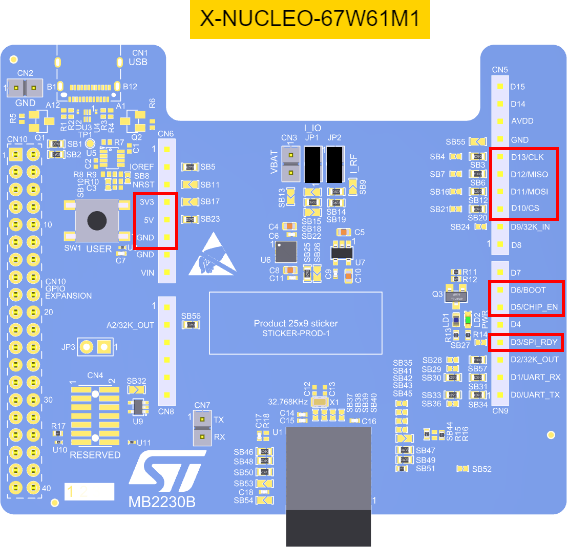

# ST67W61 Bare-metal implementation

Extension of the basic X-CUBE-ST67W61 package. It demonstrates a simplified implementation of the AT protocol (over SPI) for the Wi-Fi and BLE NCP module.

Compared to the base package, this implementation does not use FreeRTOS and the Middleware layer. The AT commands are sent over SPI in blocking mode - without DMA or interrupts.  
The application layer needs to simply pass a string containing the AT command with relevant parameters to the interface function and wait for the return value - then the response string can be checked to evaluate success / failure of the command.
Reports from the NCP (out-of-band messages) rely on the application layer to launch the SPI reception.  
This means that the application layer can be implemented to finish other tasks before allowing this unplanned communication to continue.

The list of supported commands, responses and reports can be found on the [Wiki](https://wiki.st.com/stm32mcu/wiki/Connectivity:ST67W611M_AT_Command) page.

After compilation (CubeIDE, space optimization), the project uses approximately 19 kB of Flash and 2 kB of RAM as-is.

## Project functionality

The application initializes the NCP and waits for the first incoming message to confirm it has started.  
Then, it calls several AT commands to set a basic configuration.
Network scan is done to find available Wi-Fi networks.
It connects to an access point - with SSID and password specified in the code.  
Lastly, it pings a website to verify the connection and disconnects from the network.

Incoming report messages (network scan, connection, ping and disconnection) are printed to the terminal.

UART is used for logging to the terminal of the PC connected to the host (through the printf() function).

Additional logging can be enabled to show bytes on the SPI layer.  
Outgoing AT commands and incoming replies and reports can also be logged in string format.  
See [next section](#important-files-and-functions) for details how to enable both.

## Important files and functions

Following is a list of files which are important for understanding the application flow and for potentially designing a more advanced driver.

* main.c
  * MX_SPI1_Init - initialization of SPI (communication with the NCP).
  * MX_USART2_UART_Init - initialization of UART (logging to terminal).
  * MX_GPIO_Init - pin initialization.
  * HAL_GPIO_EXTI_Rising_Callback and HAL_GPIO_EXTI_Falling_Callback - handling the external rising and falling SPI_RDY interrupts.
* stm32g0xx_hal_msp.c
  * Initialization of SPI and UART pins.
* stm32g0xx_it.c
  * Interface from system interrupt handler to main application.
* spi_port.h
  * #define NCP_SPI_HANDLE - specify the SPI peripheral handle to be used.
  * #define SPI_TRANSMIT_TIMEOUT_MS - maximum time (in ms) for the SPI transaction timeout.
  * #define SPI_PHY_LOG_CHARS - used to specify the maximum length buffer used of the string used for logging the bytes exchanged over SPI. Set to 0 to disable this log.
* spi_port.c
  * spi_port_init and spi_port_deinit - pulls the CHIP_EN high / low to turn the NCP on / off.
  * spi_port_set_cs - sets the SPI_CS pin before / after the SPI transaction.
  * spi_port_transfer - handles the SPI transaction.
  * spi_port_is_ready - checks the state of the SPI_RDY pin.
* spi_iface.h
  * #define SPI_IFACE_LOG_OUTGOING and SPI_IFACE_LOG_INCOMING - used to enable logging of transactions on the AT layer.
  * #define SPI_IFACE_ADD_TRAILING_RN - if set to 1, the driver adds "\r\n" string to the end of commands. If 0, user application needs to pass commands with this string included.
  * #define SPI_IFACE_TIMEOUT_DEF_MS and SPI_IFACE_TIMEOUT_INIT_MS - used to specify maximum timeout for the reception of the first message after NCP initialization and subsequent responses.
* spi_iface.c
  * spi_iface_lock - variable used as a mutex signifying an ongoing command / response transaction. When a command is sent, this is set to 1 to make sure any incoming message is taken as a response to this command.
  * spi_iface_init - initializes the NCP, exchanges the first AT command / response to verify it state.
  * spi_iface_send - sends an AT command and collects the response.
  * spi_iface_receive_report - receives a report from the NCP. To be called by the application when the resources allow to receive.
  * spi_iface_ncp_ready_high - interrupt function raised when the SPI_RDY pin is pulled high. If there is no ongoing command / response transaction, this is considered as an incoming report and signalled to the application.

## Supported boards

At the moment, the project is created for these boards:

* NUCLEO-G0B1RE

### Porting to other boards

Porting to other boards should be done by modifying the low-level SPI driver (another SPI, different speed, etc.,) and pin allocations to reflect the pin mapping between the given host and ST67 NCP.  
The necessary changes are mostly located in main.c/.h, spi_port.h and stm32g0xx_it.c files.

The module pinout can be found in [UM3449](https://www.st.com/resource/en/user_manual/um3449-wifibluetooth802154-connectivity-expansion-board-based-on-the-st67w611m1-module-for-stm32-nucleo-boards-stmicroelectronics.pdf) in Section 8.3 "ARDUINO® Uno V3 connector".  
The minimal list of pins which need to be connected between the host and NCP (expected name aliases are added):

* D13 - SPI_SCK
* D12 - SPI_MOSI
* D11 - SPI_MISO
* D10 - SPI_CS
* D6  - BOOT
* D5  - CHIP_EN
* D3  - SPI_RDY
* 3V3
* 5V
* GND

  
*Highlight of the used pins on the X-Nucleo board.*

UART and low speed clock signal are not included here as that functionality is not used in the project.

The high-level interface files (spi_port.c and spi_iface.c/.h) can be directly copied.

## Known limitations

With some combinations of logging enabled / disabled and command sequences, the SPI communication can get stuck.

The "AT+CWQAP" command (used to disconnect from the network) should have an "OK" response and two report messages ("+CW:DISCONNECTED" and "+CW:ERROR,19").
Instead, the "OK" response comes only after "+CW:DISCONNECTED" and "+CW:ERROR,19" messages.

The script to update the ST67 FW binary (originally located inside Projects\ST67W6X_Utilities\Binaries) is not ported. It is expected that the ST67 will have an up-to-date FW installed by using the base package prior to using this example.
