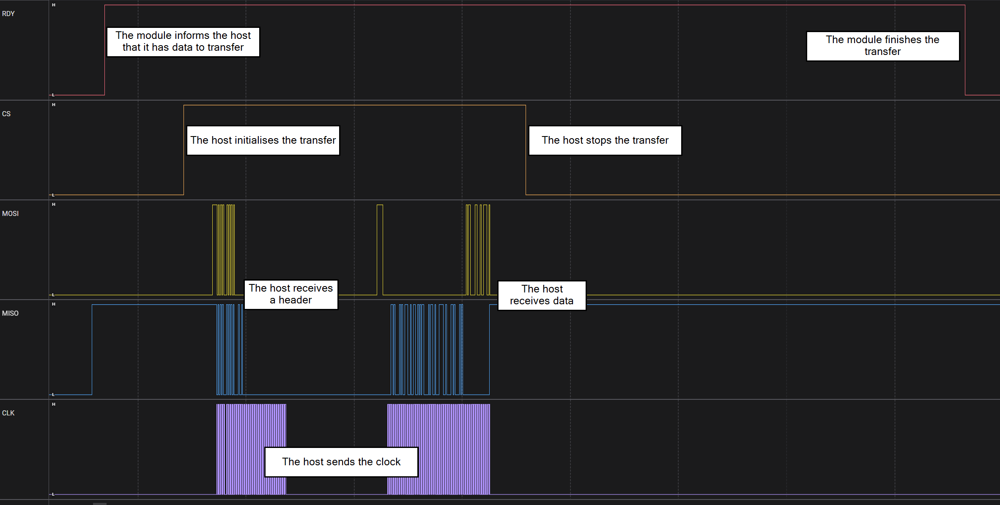
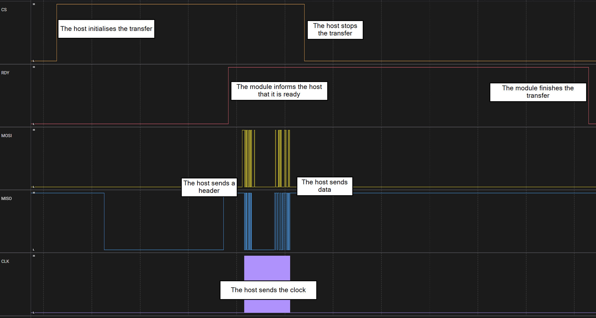
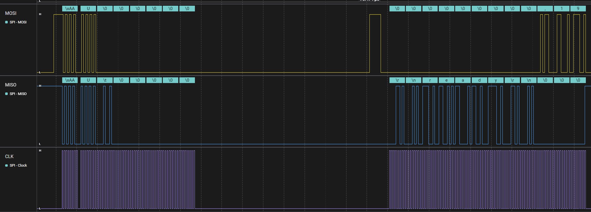
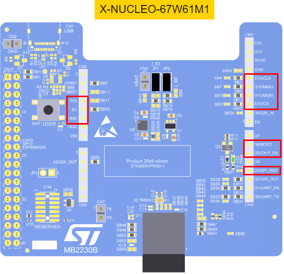

# ST67W61 Bare-metal implementation

- [ST67W61 Bare-metal implementation](#st67w61-bare-metal-implementation)
  - [1. Supported boards](#1-supported-boards)
  - [2. Known limitations](#2-known-limitations)
  - [3. Projects functionality](#3-projects-functionality)
    - [3.1 Echo](#31-echo)
    - [3.2 HTTP\_BLE\_Heartrate](#32-http_ble_heartrate)
    - [3.3 MQTT\_BLE\_Commissioning](#33-mqtt_ble_commissioning)
  - [4. SPI driver explanation](#4-spi-driver-explanation)
    - [4.1 Communication timing](#41-communication-timing)
    - [4.2 Low-Level SPI Frame Format](#42-low-level-spi-frame-format)
    - [4.3 Startup sequence](#43-startup-sequence)
    - [4.4 Command–Response Model](#44-commandresponse-model)
    - [4.5 Data Sending Model](#45-data-sending-model)
    - [4.6 Handling Out-of-Band Reports](#46-handling-out-of-band-reports)
    - [4.7 Implementation Details](#47-implementation-details)
  - [5. Porting to other boards](#5-porting-to-other-boards)

Extension of the basic X-CUBE-ST67W61 package. It demonstrates a simplified implementation of the AT protocol (over SPI) for the Wi-Fi and BLE NCP module.

Compared to the base package, this implementation does not use FreeRTOS and the Middleware layer. The AT commands are sent over SPI in blocking mode - without DMA or interrupts.  
The application layer needs to simply pass a string containing the AT command with relevant parameters to the interface function and wait for the return value - then the response can be checked to evaluate success / failure of the command.

The list of supported commands, responses and reports can be found on the [Wiki](https://wiki.st.com/stm32mcu/wiki/Connectivity:Wi-Fi_MCU_Hardware_Setup) page.

After compilation (using LL drivers, CubeIDE, space optimization), memory consumption of approximately 22 kB of Flash and 3.5 kB of RAM can be achieved - with application code included.
This memory footprint can be achieved with the MQTT_BLE_Commissioning application.

It is expected that the ST67W611M will have an up-to-date FW (the "Mission profile" binary) installed by using the base package prior to using this example.
Please see the [Wiki](https://wiki.st.com/stm32mcu/wiki/Connectivity:ST67W611M_AT_Command) page.

## 1. Supported boards

The driver is ported to these boards (with the given example applications):

- NUCLEO-U575ZI-Q
  - Echo
  - HTTP_BLE_Heartrate
- NUCLEO-G0B1RE
  - Echo
  - MQTT_BLE_Commissioning
- NUCLEO-C031C6
  - MQTT_BLE_Commissioning

See [Porting to other boards](#porting) for details on pinout etc, and how to port to other Nucleo boards.

## 2. Known limitations

On the C0 host, the SPI speed is limited to 6 MHz.

The driver has been tested with NCP binary v1.0.0. The main difference is in the list of possible report messages and usage of several commands.

The script to update the ST67 FW binary (originally located inside Projects\ST67W6X_Utilities\Binaries) is not ported. 

## 3. Projects functionality

All projects have the following functionality implemented in the user-application level code:

- UART is used for logging to the terminal of the PC connected to the host (through the printf() function).
  - Line ending: "CR+LF"
  - Baud rate: 921600 (NUCLEO-U575ZI-Q) or 115200 (NUCLEO-G0B1RE, NUCLEO-C031C6)
- Incoming report messages (such as network scan results, connection, ping) are printed to the terminal.

### 3.1 Echo

Wifi is initialized in station mode.
Network scan is done to find available Wi-Fi networks.
It connects to an access point - with SSID and password defined by WIFI_SSID, WIFI_PASSWORD in the main.c (line 41).
Lastly, it pings a website to verify the connection and disconnects from the network.

### 3.2 HTTP_BLE_Heartrate

Wifi is initialized in station mode and connects to an access point - with SSID and password defined by WIFI_SSID, WIFI_PASSWORD in the heartrate.c (line 8).
The assigned IP address is printed to the terminal.  
BLE is initialized in server role and the Heartrate service with characteristics is created.
Using an interrupt from a HW timer, dummy data is periodically updated in global variables.  
When a web client (web browser on a phone) connects to the Wifi station's IP address, the application sends an HTTP page displaying graphs for heartrate and calories consumed.
The HTTP code contains instruction to periodically request new values.
The web client sends these requests and the application responds with current values.  
After a BLE client (e.g. BLE Toolbox application) connects, it can view the current state of the BLE characteristics with values being updated automatically by the application.  
BLE and Wifi connection can be mantained in parallel.

### 3.3 MQTT_BLE_Commissioning

Wifi is initialized in station mode.
BLE is initialized in server role and the BLE commissioning service with characteristics is created.  
The application tries to connect to a previously saved access point.
If not successful, it waits for the Wifi parameters to be set through the BLE characteristic (using BLE Toolbox application).
If successfull, the user can still connect through BLE and change to a different Wifi network.  
After Wifi connection, MQTT is initialized and connected to a broker.
The IoT MQTT Panel application (available for [Android](https://play.google.com/store/apps/details?id=snr.lab.iotmqttpanel.prod&pli=1) and [iOS](https://apps.apple.com/pl/app/iot-mqtt-panel/id6466780124)) can then be used to connect to the same broker.
With the configuration file provided in the MQTT_Panel_config folder, the IoT MQTT Panel application can receive RSSI statistics and send data which mimic a controlling the level and color of an LED light.
Incoming messages are parsed and displayed on the terminal.

## 4. SPI driver explanation

### 4.1 Communication timing

When the NCP has data to transfer, it raises the RDY signal/interrupt to inform the host, which in turn raises CS and generates clock in order to receive the data.

<figure>
    
    <figcaption>Receiving data</figcaption>
</figure>

When sending data, the host needs to raise the CS pin and wait for the NCP to raise the RDY pin.
After that, the host generates clock and sends its data.

<figure>
    
    <figcaption>Transmitting data</figcaption>
</figure>

When making two or more transactions in a sequence, the host always needs to wait unti the RDY pin is pulled low before starting the next transaction.
Otherwise, the module may get into an error state.  
Good example:

```
→ CS High
← RDY High
→ ... data ...
→ CS Low
← RDY Low
→ CS High
← RDY High
→ ... data ...
→ CS Low
← RDY Low
```

Bad example:
```
→ CS High
← RDY High
→ ... data ...
→ CS Low
→ CS High
(RDY still High)
→ ... data ...
(module cannot process the data)
```

### 4.2 Low-Level SPI Frame Format

There are two possible formats for any communication with the NCP.
Each time communication is established (from either side), the first (header) frame transmitted will have the following format:

| Field | Size (bytes) | Description |
|--------|--------------|-------------|
| Magic Code | 2 | Fixed value `0x55AA` identifying a valid SPI frame, starting with the lower byte |
| Data Length | 2 | Length of the payload (in bytes), starting with the lower byte |
| Reserved / Padding | 4 | Reserved for alignment or protocol extension |

Then the initiating side will transmit the specified number of data bytes in the following frame.
This frame contains only data - without any leading header.  
If the length of the data is not 4-byte aligned, the frame needs to be padded by 0x88 data.
In such a case, the length specified in the header frame is still the number of valid data bytes (without padding).
This is illustrated in the figure below.

<figure>
    
    <figcaption>Header and data frame</figcaption>
</figure>

Example (sending "AT" and receiving "OK"):

```
→ CS High
← RDY High
→ 0xAA | 0x55 | 0x04 | 0x00 | 0x00 | 0x00 | 0x00 | 0x00
→ 0x41 | 0x54 | 0x0D | 0x0A
=    A |    T |   \r |   \n
← RDY Low
→ CS Low

→ CS High
← RDY High
← 0xAA | 0x55 | 0x06 | 0x00 | 0x00 | 0x00 | 0x00 | 0x00
← 0x0D | 0x0A | 0x4F | 0x48 | 0x0D | 0x0A | 0x00 | 0x00
=   \r |   \n |    O |    K |   \r |   \n
← RDY Low
→ CS Low
```

### 4.3 Startup sequence

The following sequence needs to be followed before interacting with the NCP:

1. The host sets the EN (Chip Enable) pin high
2. The host waits for the NCP to set the RDY pin high
3. The NCP sets the RDY pin high
4. The NCP transmits `ready`
5. The host transmits `AT` *
6. The NCP replies with `OK` *

\* Steps 5 and 6 are not strictly necessary, but they are "a good practice" way to check the basic functionality.

### 4.4 Command–Response Model

Commands are ASCII AT-style strings ending with `\r\n`. Each command generates an immediate response, indicating the success / failure of the command.
Responses are also terminated with `\r\n`.

| Command Type | Example | Description |
|---------------|----------|-------------|
| SET | `AT+CMD=<val>` | Set configuration |
| QUERY | `AT+CMD?` | Get parameter |
| EXECUTE | `AT+CMD` | Execute action |

SET and EXECUTE commands typically generate a single response, such as `OK` or `ERROR`.
Some commands (described in the [following section](#data_cmds)) additionally produce `>` which indicates that the NCP is ready to receive additional data frame.  
For QUERY commands, the response will be composed of two parts: a response with data corresponding to the query followed by `OK`.
`busy p` response means that the NCP is busy but it will continue with execution and response in the next frame.

| Response | Meaning |
|-----------|----------|
| `OK` | Command success |
| `ERROR` | Command or syntax error |
| `busy p` | Device not ready |
| `>` | Ready to receive binary data |
| `+CMD:<val>` | Query result |

Example:

```
→ AT+BLEINIT?
← busy p
← +BLEINIT:0
← OK
```

### 4.5 Data Sending Model<a id='data_cmds'></a>

Some of the AT commands require the host to send data in a separate SPI frame.
These are typically for writing into the FLASH or EFUSE region, sending data on a UDP / TCP port, publishing data on MQTT or updating BLE characteristics data.  
After receiving one of these commands, the NCP will respond with `OK>`.
The host is then expected to transmit the data (without the header frame) with length specified in the command frame.
The NCP will confirm reception of the data by either of the following responses:

| Response | Meaning |
|-----------|----------|
| `SEND OK` | Data sent successfully |
| `SEND FAIL` | Data failed |

Example:

```
→ AT+CIPSEND=5
← OK
← >
→ HELLO
← SEND OK
```

### 4.6 Handling Out-of-Band Reports

Some commands, such as Wifi scan, will produce the initial `OK` response and the NCP will later send the result of the operation in a separate report.
User actions, such as receiving data from a connected device, will also elicit a report.  
These reports can generally come at any time, even between a command and its response.

Example (disconnect from Wifi network - reports arrive before response):

```
→ AT+CWQAP
+CW:DISCONNECTED
+CW:ERROR,19
← OK
```

Example (scan Wifi networks - reports arrive after response):

```
→ AT+CWLAP
← OK
...
...
← +CWLAP: ....
← +CWLAP: ....
← +CWLAP: ....
← +CW:SCAN_DONE
```

### 4.7 Implementation Details

The file spi_iface.c handles the above functionality from adding trailing `\r\n` characters to sending commands and waiting for responses.  
It should be initialized by calling `spi_iface_init()` with a pointer to an application callback to handle report messages.
RDY pin setting and reception of the first `ready` report is handled in this function, as well as testing the interface by sending the first AT command.

Sending commands is possible by calling `spi_iface_command()` with an ASCII string as an argument.
When sending a command, the application waits in a blocking loop until a response is received.
An integer status is returned to quickly verify success / failure, based on response timeout, `ERROR` response, etc.

All incoming reports (both during command / data exchange and out of this transaction) are passed to the main application to be handled.  
Both responses and reports are returned as pointers to dynamically allocated memory.
It is then the responsibility of the main application to free this memory (after handling the data as necessarry) to avoid memory overflows.

spi_port.c then handles the low-level SPI transactions.
The driver is prepared for both HAL and LL driver integration, based on pre-compiler flags (`USE_HAL_DRIVER`).

Additional logging can be enabled to show bytes on the SPI layer.  
Outgoing AT commands and incoming replies and reports can also be logged in string format.

Following is a list of files which are important for understanding the application flow and for potentially designing a more advanced driver.

| File                  | Function / Define | Description   |
|:----:|:----:|:----:|
| **spi_iface.c**       |     | SPI frame handling, command/data TX, response parsing. |
|        | `spi_iface_lock` | Mutex variable for ongoing command/response transaction. |
|        | `spi_iface_init`| Initializes NCP, exchanges first AT command/response.|
|        | `spi_iface_deinit`| Deinitializes NCP. |
|        | `spi_iface_command` | Sends AT command and collects response. |
|        | `spi_iface_data` | Sends data payload without header frame.  |
|        | `spi_iface_receive_report` | Receives report from NCP. |
|        | `spi_iface_ncp_ready_high`| Interrupt on RDY pin high; signals incoming report if no ongoing transaction. |

||||
|:----:|:----:|:----:|
| **spi_port.c**        | | Hardware SPI interface and GPIO control. |
| | `spi_port_init` and `spi_port_deinit`| Pulls the CHIP_EN high / low to turn the NCP on / off.|
|                       | `spi_port_set_cs`                                    | Sets the SPI_CS pin before / after the SPI transaction.                                                                             |
|                       | `spi_port_transfer`                                  | Handles the SPI transaction.                                                                                                        |
|                       | `spi_port_is_ready`                                  | Checks the state of the RDY pin.|

||||
|:----:|:----:|:----:|
| **main.c**            |  | Main user-application file. |
| | `wifi_iface_report_cb` | Application callback to handle incoming reports. |
| | `MX_SPI1_Init` | Initialization of SPI (communication with the NCP). |
|                       | `MX_USART2_UART_Init`                                | Initialization of UART (logging to terminal).                                                                                       |
|                       | `MX_GPIO_Init`                                       | Pin initialization.                                                                                                                 |
|                       | `HAL_GPIO_EXTI_Rising_Callback`                      | Handling the external rising SPI_RDY interrupt.                                                                                     |
|                       | `HAL_GPIO_EXTI_Falling_Callback`                     | Handling the external falling SPI_RDY interrupt.                                                                                    |

||||
|:----:|:----:|:----:|
| **stm32g0xx_hal_msp.c** |                          | Initialization of SPI and UART pins.                                                                                               |

||||
|:----:|:----:|:----:|
| **stm32g0xx_it.c**    |                            | Interface from system interrupt handler to main application.                                                                        |

||||
|:----:|:----:|:----:|
| **spi_port.h**        |  | Additional defines for the spi_port.c file. |
|  | `#define NCP_SPI_HANDLE`                             | Specify the SPI peripheral handle to be used.                                                                                       |
|                       | `#define SPI_TRANSMIT_TIMEOUT_MS`                    | Maximum time (in ms) for the SPI transaction timeout.                                                                               |
|                       | `#define SPI_PHY_LOG_CHARS`                          | Max buffer length for logging SPI bytes. Set to 0 to disable this log.                                                              |

||||
|:----:|:----:|:----:|
| **spi_iface.h**        |  | Additional defines for the spi_iface.c file. |
|     | `#define SPI_IFACE_LOG_OUTGOING` and `SPI_IFACE_LOG_INCOMING` | Enable logging of transactions on the AT layer.                                                                                     |
|                       | `#define SPI_IFACE_ADD_TRAILING_RN`                  | If 1, driver adds "\r\n" to commands; if 0, user must include it.                                                                   |
|                       | `#define SPI_IFACE_TIMEOUT_DEF_MS` and `SPI_IFACE_TIMEOUT_INIT_MS` | Max timeout for reception after NCP initialization and subsequent responses.                                                        |

## 5. Porting to other boards<a id='porting'></a>

Porting to other boards should be done by modifying the low-level SPI driver (another SPI, different speed, etc.,) and pin allocations to reflect the pin mapping between the given host and ST67 NCP.  
The necessary changes are mostly located in main.c/.h, spi_port.h and stm32g0xx_it.c files.

The module pinout can be found in [UM3449](https://www.st.com/resource/en/user_manual/um3449-wifibluetooth802154-connectivity-expansion-board-based-on-the-st67w611m1-module-for-stm32-nucleo-boards-stmicroelectronics.pdf) in Section 8.3 "ARDUINO® Uno V3 connector".  
The minimal list of pins which need to be connected between the host and NCP (expected name aliases are added):

* D13 - SPI_SCK
* D12 - SPI_MOSI
* D11 - SPI_MISO
* D10 - SPI_CS
* D6  - BOOT
* D5  - CHIP_EN
* D3  - SPI_RDY
* 3V3
* 5V
* GND

  
*Highlight of the used pins on the X-Nucleo board.*

UART (used with ST67W61 "Manufactirng mode" binary) and low speed clock signal are not included here as that functionality is not used in the project.

The high-level interface files (spi_port.c and spi_iface.c/.h) can be directly copied.
